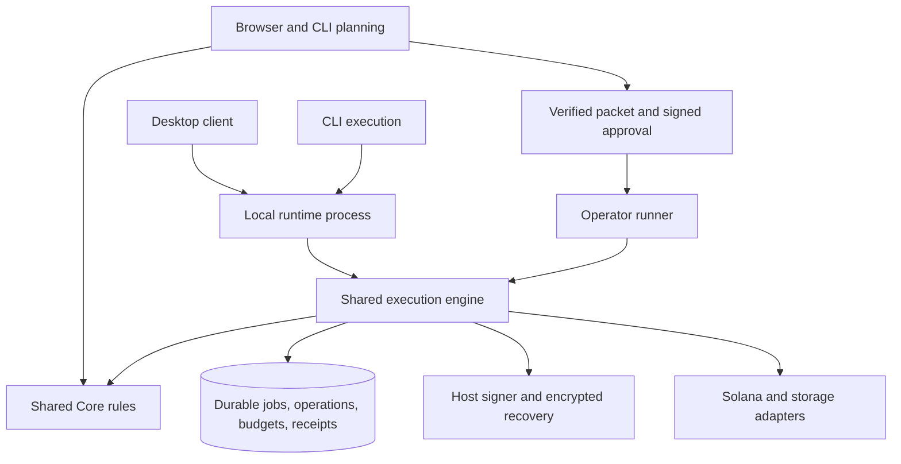

# Architecture review

Review scope: the shared-runtime worktree through complete Raydium API bundles, temporary account refunds, and real-router validator recovery. The changes are delivered through draft PR #52. The completion checklist in [execution-runtime.md](execution-runtime.md) records the full build scope.

## Assessment

Trebuchet has a useful execution foundation: one profile owner, SQLite operation records, saved signed transactions, explicit approval checks, and finalized receipt checks. Browser and CLI planning share Core rules. Packet validation binds the verified inputs to an operator's signed approval.

The main risk is uneven adoption. Several live actions use the engine; other actions still depend on process memory and direct transaction submission. Complete coverage should be the next delivery goal. Each action that can spend needs the same ownership, approval, durable record, and recovery rules.

## Should the CLI start a real instance?

Yes. An execution command should attach to the profile's runtime. If the profile has no owner, the command should start a runtime under the profile lock. Each response should identify that runtime and the saved operation. The runtime should continue an accepted job after the client exits.

Planning, estimates, and proof checks can run directly against Core. `runtime start`, `runtime status`, `runtime stop`, and saved-launch commands already use the real local owner. `execute` currently uses the demo runtime. Live execution needs the remaining spending adapters, whole-launch approval, and host custody.

The desktop currently hosts the local API in its main process. The target gives the runtime its own process. Both desktop and CLI use the same authenticated client contract.

## Target structure

Each local profile has one runtime owner. Each runner uses its own durable profile. Hosts supply the signer, storage location, and service connections. The engine owns operation order and recovery decisions.

## Priority improvements

### 1. Move every spend into a durable workflow

Quote-token acquisition still stores jobs in `server.js`'s `acquireJobs` Map. `swapService.js` signs provider transactions directly. Its retries use the current token balance to decide whether another purchase is needed. A timeout can leave a submitted transaction unresolved while a later attempt prepares another purchase. Setup, trade, and cleanup can also span several transactions.

Save the complete purchase plan and stable step IDs before the first spend. Reserve the wallet for the workflow. Commit each signed transaction before submission. Recover its original signature and finalized result before replacing it. Keep setup and cleanup receipts available after restart. A low output balance should lead to an explicit decision under the remaining budget.

The swap review checks provider messages before signing. It binds the input amount, minimum output, wallet, network, token accounts, setup funding, cleanup destination, and resolved lookup-table addresses. The durable adapter now adds finalized account checks, fee and rent checks, saved jobs, and receipt recovery. Failed purchases now retain fee evidence and a separately approved cleanup plan. Balance reconciliation preserves outside transfers. The private-validator drill covers the real Raydium trade and process recovery. Production acquisition still needs durable management across quote mints and its service connection; see the latest stage in [execution-runtime.md](execution-runtime.md).

The validator drill now covers crashes after setup, trade, and cleanup acceptance, including delayed status replies and exact-byte resubmission. Extend that acceptance test through the acquisition HTTP service and its durable multi-mint job.

The current Raydium Trade API bundle now has a reviewed contract for SOL setup, trade, account creation, and cleanup. Its full bundle stays in the approval digest. The validator tests cover both host-built SPL setup and the complete API bundle, including temporary intermediate-account refunds. These contracts are ready for the acquisition service to adopt.

### 2. Enforce a budget for the whole launch

Existing engine adapters approve bounded operations. A launch also needs one shared spending ledger across uploads, swaps, mint creation, liquidity, retries, and sweep fees.

Store reservations, actual costs, and remaining approval in SQLite. Reserve funds before signing. Finalized failures still consume their transaction fees. Keep gross payments, returned rent, and net cost as separate fields. A returned rent balance should follow an explicit reuse policy.

Acceptance: interrupt a launch at each spending phase, resume it, and compare the full ledger with finalized transaction receipts. Two clients must observe the same remaining budget.

### 3. Give execution its own process and lifecycle

`main.js` imports and starts `server.js` in Electron's main process. The runtime client and profile lock already provide much of the attachment contract.

Move runtime startup into a supervised child process. Define when the owner accepts work, drains active requests, stops, and recovers. Let a client disconnect while the runtime keeps its durable job. Include protocol and capability versions in the handshake so each client can check host support.

Acceptance: close and reopen desktop during a submitted operation, attach from CLI, and recover the original operation. Repeat with two clients starting together.

### 4. Complete the custody contract for every host

Fresh local wallets now require protected recovery storage. Token creation also needs durable custody of the selected mint signer. The runner needs encrypted operator-controlled recovery material and durable storage through final sweep verification.

Use one signer interface with explicit capabilities. Keep encrypted key material separate from public execution records. Preserve old recovery material during migration. Verify recovery after a host restart before accepting funding.

Acceptance: recover the same wallet and mint identity after process loss. A completed sweep receipt must commit before the host removes recovery material.

The desktop process split, mint signer custody, and production upload connection have concrete proposals. Their automatic approval review requests remain pending; see the proposal links in [execution-runtime.md](execution-runtime.md).

### 5. Finish the service and renderer boundaries

`server.js` still has about 8,700 lines. Ordinary launch methods have been extracted, but HTTP setup, background jobs, and feature services remain closely tied together. The renderer has 46 feature source files, which the build joins into one shared scope.

Give each server feature an ordinary service contract and a small HTTP adapter. Move job state into durable services. In the renderer, give features explicit imports and a small shared state interface. Keep cost and validation rules in browser-safe Core.

Acceptance: test services through ordinary inputs and outputs. Add dependency checks for Core's browser boundary and for host-only signing and storage modules. Verify the shipped browser bundles after each feature move.

### 6. Qualify CLI and runner through the same launch contract

The runner verifies packets and signed approval. Its launch endpoint currently returns `NOT_READY`, and its deployment configuration uses temporary state. The CLI's live execution command also needs connection to the shared engine.

Connect both hosts to the same launch workflow once spending coverage and custody are ready. Give the runner a durable profile and a clear operator recovery path. Expose stable launch IDs, current operations, receipts, and the action needed to resume.

Acceptance: execute the same saved plan through desktop, CLI, and runner test hosts. Cover competing clients, failed database commits, uncertain RPC responses, expired approval, partial liquidity, and restart through the final sweep. Retain the validator drills for actual chain behavior alongside the fast fault-injection tests.

## Delivery order

1. Durable swaps and remaining spending paths.
2. Whole-launch spending reservations and recovery.
3. Desktop process split and host custody, after the pending approvals.
4. Live CLI and durable runner execution.
5. Further HTTP and renderer module extraction alongside focused feature work.

The existing engine tests and validator drills provide a strong base. Completion should be judged by a full recovered launch through each supported host, with every payment and final receipt accounted for.
