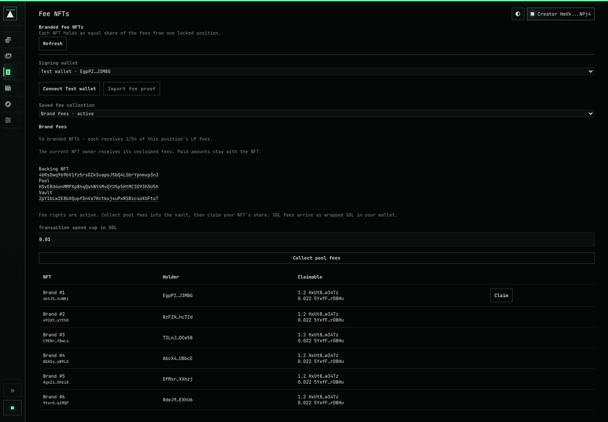
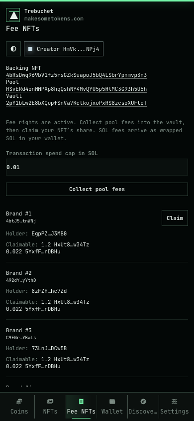

# Fee NFT validation

Validated on 2026-10-04 with Node 22.22.3 and Agave 2.3.13.

- App suite: 1,302 passed, 10 skipped, 0 failed.
- Core, runner and runtime contracts: 748 passed.
- Fee NFT tests: 9 passed.
- Rust contract tests: 5 passed.
- Solana SBF build passed with the checked-in lockfile.
- Browser tests passed at 1440×1000 and 390×844. The phone Claim button stays above the fixed navigation.
- The local validator test passed with real Metaplex Core and Meteora DAMM v2 programs. It covered immutable deployment and build hash checks, backing recovery, NFT distribution, trading fees, vault harvest, equal claims, repeated claims, NFT transfers, fixed shares, alternate fee account rejection, resumed setup, portable proofs and unsigned holder transactions.

The screenshots use browser fixtures. Addresses and amounts in them are test data. The local validator uses local test funds. Raydium has SDK account-order and discriminator tests; its funded devnet harvest is the next protocol check before production use.

Retained protocol binary hashes (SHA-256):

```text
Metaplex Core: 96fa631a61234766afa538437c5166c628100dbc70e5c3ddb2f306d5dc5a8ba5
Meteora DAMM v2: 4d5b920baebc090f89b2e8796a3452ed067c9667a143058c96a312f2c1e6848b
```

See [program setup and test commands](../../fee-nfts.md).



